# how-enable-AzureIoTEdge-on-NvidiaTX2-drones {#how-enable-azureiotedge-on-nvidiatx2-drones}

HOWTO

DEPLOY APP TO NVIDIA TX2 BOARD USING AZURE IOT EDGE

This walkthrough is comprised on 4 main activities:

1.     Install required software on Nvidia TX2 board

2.     Configure Azure IoT Edge on TX2 board

3.     Prepare containers to use board’s GPU capabilities

4.     Deploy an app using Azure IoT Edge

# Pre-requirements {#pre-requirements}

·       Nvidia TX2 board.

·       [JetPack 3.3](https://developer.nvidia.com/embedded/dlc/jetpack-l4t-3_3) from Nvidia official site

·       Local computer running Linux in a graphical environment (necessary to connect TX2 card and install JetPack 3.3)

·       An Azure subscription and privileges to create resources.

# 1.   Install required software on Nvidia TX2 board {#1-install-required-software-on-nvidia-tx2-board}

## ·      Install base software from JetPack 3.3 {#install-base-software-from-jetpack-3-3}

This will install all the base software for TX2, including the ability to use containers on the board.

a.     Connect TX2 card and configure it to have internet connection.

b.     Run ifconfig on TX2 and take a note on the IP shown.

c.      Download [JetPack 3.3](https://developer.nvidia.com/embedded/dlc/jetpack-l4t-3_3) from Nvidia in the local computer running Linux. Membership is required to download but is free.

d.     If needed, change permission to run the installation file: chmod +x JetPack-L4T-3.3-linux-x64_b39.run

e.     Run installation file ./ JetPack-L4T-3.3-linux-x64_b39.run

f.      It is strongly recommended to define a new folder for all the software to be downloaded during the installation process. Those files will be required in next sections. 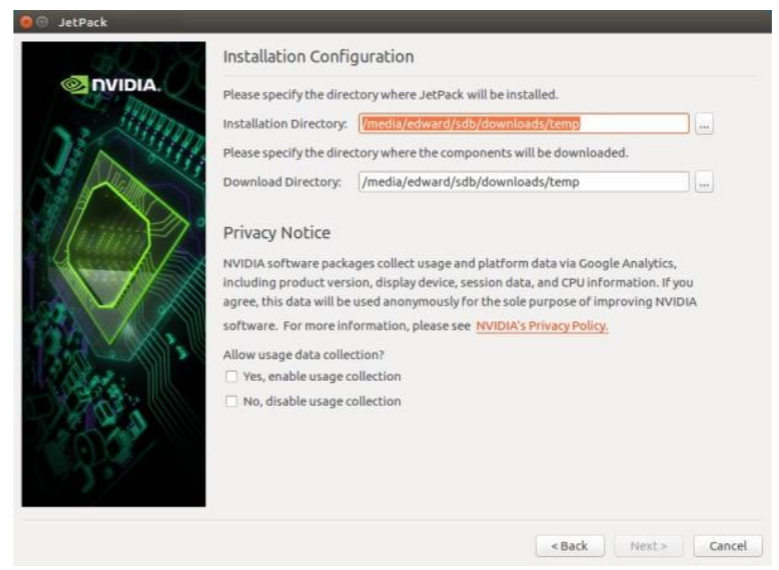

g.     Select Jetson TX2 as development environment. 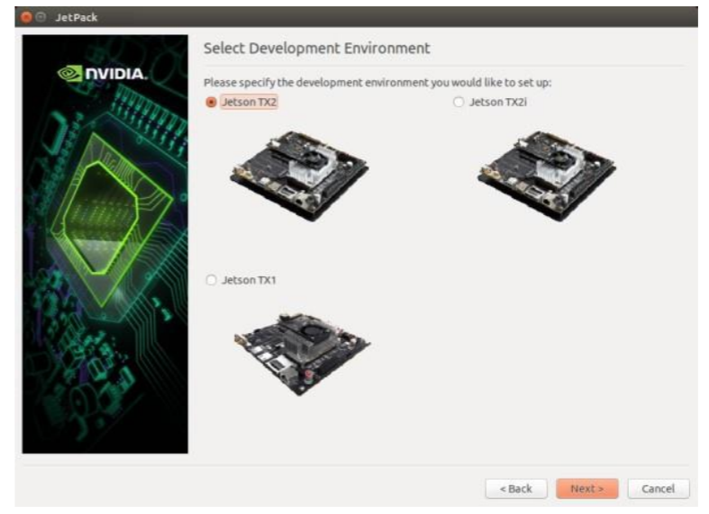

h.     Add sudo password to stat installation 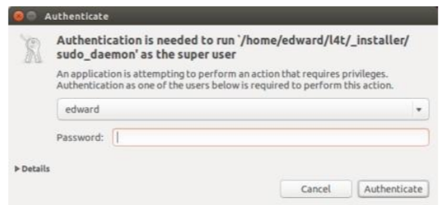

i.       Install all packages selecting “Full” installation in the upper right corner of the screen: 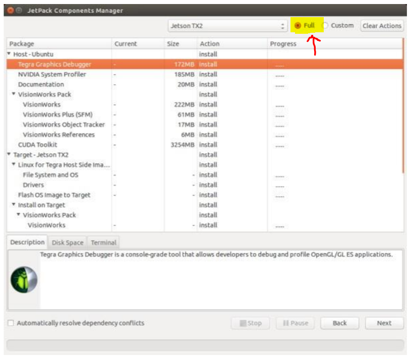

j.       If the TX2 board has connection to internet, select this network layout 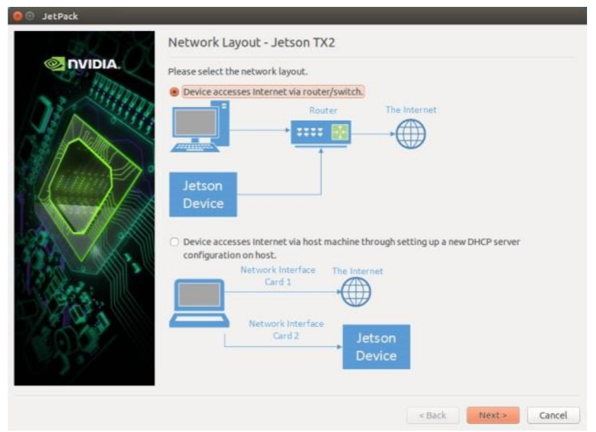

k.     When a pop-up screen appears, select the steps to put TX2 board in the FORCE USB Recovery Mode. 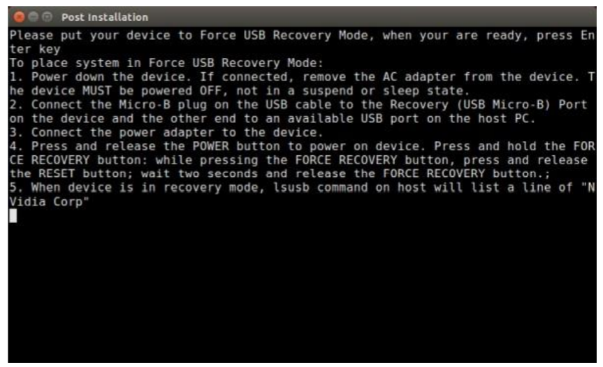

l.       Installation of components will begin.

m.   When installation is finished DO NOT select “Remove downloaded files” option. Those files will be needed in next sections.

## ·      Installing CUDA libraries natively on TX2 board {#installing-cuda-libraries-natively-on-tx2-board}

After JetPack 3.3 installation and flashing the device we proceed to install CUDA libraries on the TX2

a.     Go to JetPack’s installation folder (jetpack_download).

b.     Execute following commands: $ sudo su - $ dpkg -i cuda-repo-l4t-9-0-local_9.0.252-1_arm64.deb   $ apt-key add /var/cuda-repo-9-0-local/7fa2af80.pub   $ apt-get update   $ apt-get install cuda-toolkit-9-0 -y $ dpkg -i cuda-repo-l4t-9-0-local_9.0.252-1_arm64.deb

## ·      (Optional) Installing TensorFlow libraries natively on TX2 board {#optional-installing-tensorflow-libraries-natively-on-tx2-board}

a.     These commands allows to install TensorFlow natively in the board: sudo apt-get update sudo apt-get install python3-dev wget [https://bootstrap.pypa.io/get-pip.py](https://bootstrap.pypa.io/get-pip.py) sudo -H python get-pip.py # sudo -H python3 get-pip.py (in case python isn’t available) sudo -H pip install --extra-index-url https://developer.download.nvidia.com/compute/redist/jp33 tensorflow-gpu

# 2.   Configure Azure IoT Edge on TX2 board {#2-configure-azure-iot-edge-on-tx2-board}

## ·      Install Azure IoT Edge runtime on TX2 {#install-azure-iot-edge-runtime-on-tx2}

This will install Azure IoT Edge in multi-architecture mode

# enable installation of 32 bit packages

sudo dpkg --add-architecture armhf

# install compilers and libraries

sudo apt-get install libc-bin libc-bin libc-dev-bin libc6 libc6:armhf libc6-dev libgcc1 libgcc1:armhf locales

wget http://ports.ubuntu.com/ubuntu-ports/pool/main/h/hostname/hostname_3.16ubuntu2_armhf.deb

sudo dpkg -i ./hostname_3.16ubuntu2_armhf.deb

wget [http://ftp.us.debian.org/debian/pool/main/o/openssl1.0/libssl1.0.2_1.0.2q-2_armhf.deb](http://ftp.us.debian.org/debian/pool/main/o/openssl1.0/libssl1.0.2_1.0.2q-2_armhf.deb)

sudo dpkg -i libssl1.0.2_1.0.2q-2_armhf.deb

sudo apt-get install -f

# If you get any error message, it may be related to the fact you have a non-compatible

# version of libssl like the libsll-dev version. In this case, just purge it with 

# sudo apt-get purge libssl-dev

wget https://aka.ms/libiothsm-std-linux-armhf-latest -O libiothsm-std.deb

sudo dpkg -i ./libiothsm-std.deb

wget https://aka.ms/iotedged-linux-armhf-latest -O iotedge.deb

sudo dpkg -i ./iotedge.deb

sudo apt-get install -f

## ·      Create a device in Azure IoT Hub portal {#create-a-device-in-azure-iot-hub-portal}

This step will create a device in Azure IoT Hub and configure it for running

a.  Login in Azure portal and login with your credentials [https://ms.portal.azure.com](https://ms.portal.azure.com)

b.  Go to IoT Hub service. If there isn’t an IoT Hub created, please follow this tutorial to deploy one instance: [https://docs.microsoft.com/en-us/azure/iot-hub/iot-hub-create-through-portal](https://docs.microsoft.com/en-us/azure/iot-hub/iot-hub-create-through-portal)

c.  Create an IoT Edge device. IoT Hub -&gt; IoT Edge -&gt; Add an IoT Device 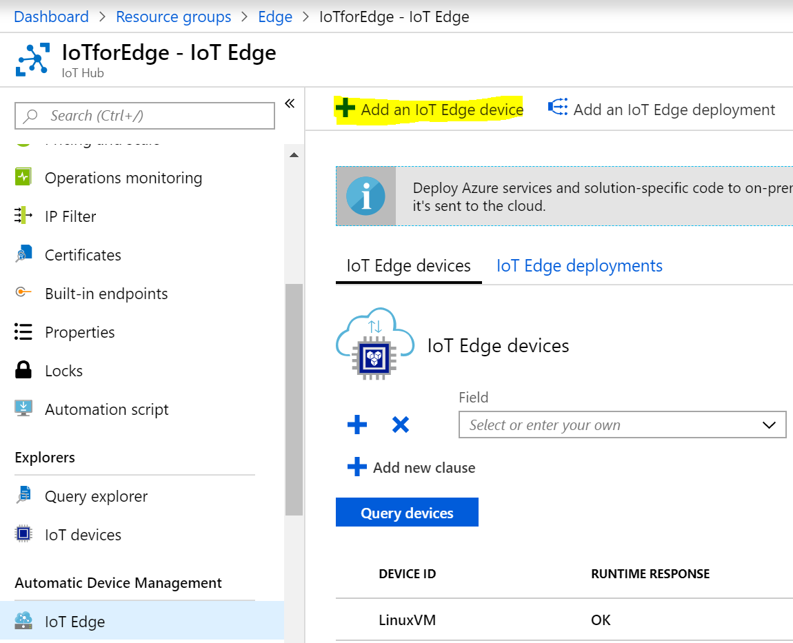

d.  Complete “Device ID” field with a name representative for the edge device. Then click on “Save” button. 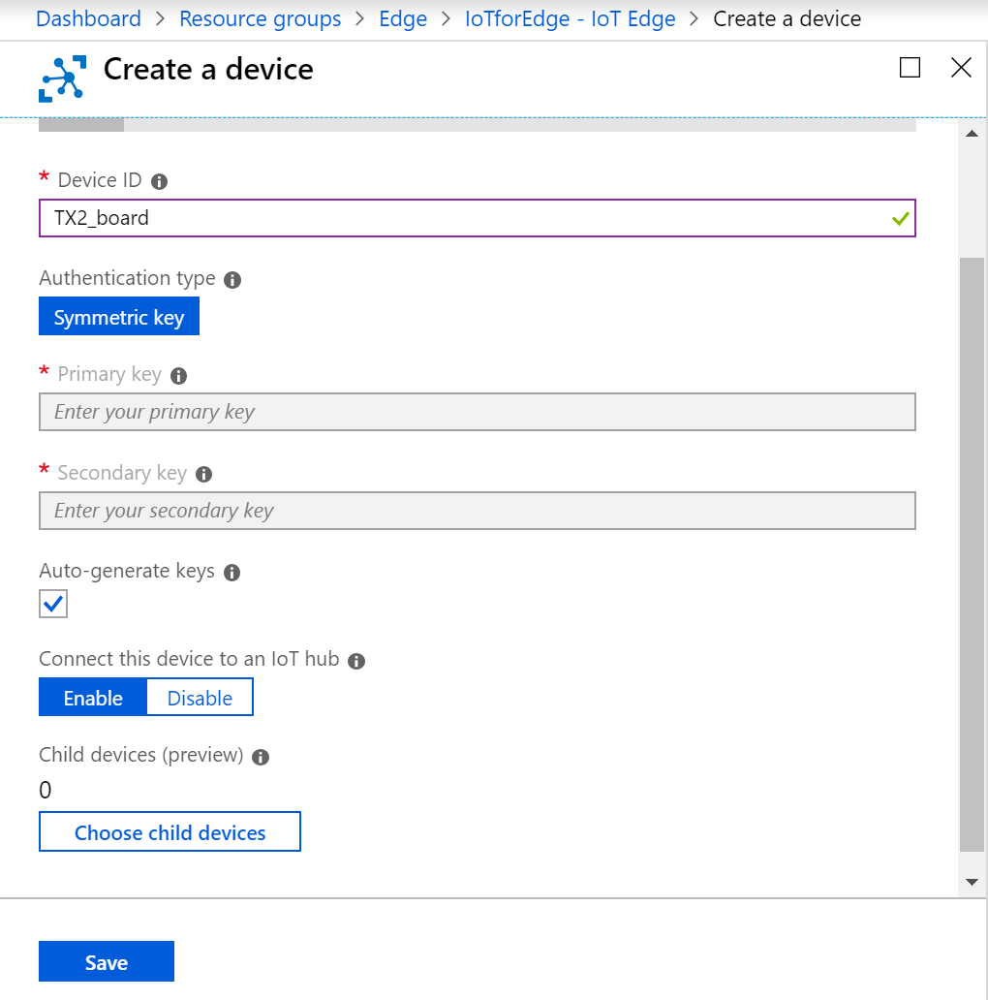

e.  After creation, select the new device create from the list and from “Device details” screen copy and take note of “Connection string (primary key)” field. It will be used in the next section. 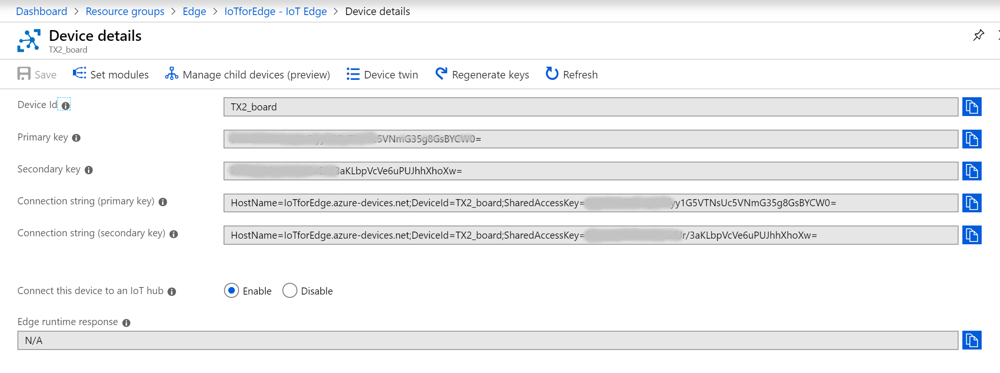

f.  Define the arm images to use in IoT Edge native modules (EdgeAgent and EdgeHub). From previous screen, select “Set Modules” and then “Configure advance Edge Runtime settings” 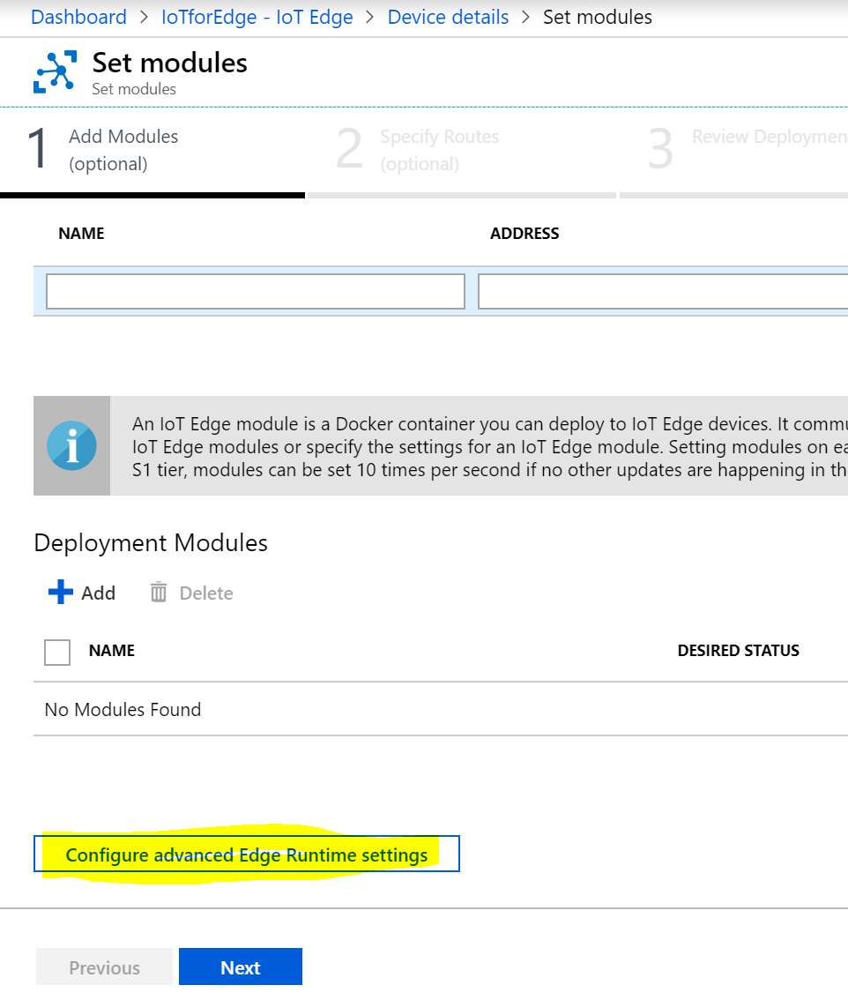 Then change EdgeAgent and EdgeHub as follows

a.  EdgeHub: “mcr.microsoft.com/azureiotedge-hub:1.0” -&gt; “mcr.microsoft.com/azureiotedge-hub:1.0.4-linux-arm32v7” 

b.  EdgeHub: Scroll down and change “mcr.microsoft.com/azureiotedge-agent:1.0” -&gt; “mcr.microsoft.com/azureiotedge-agent:1.0.4-linux-arm32v7” 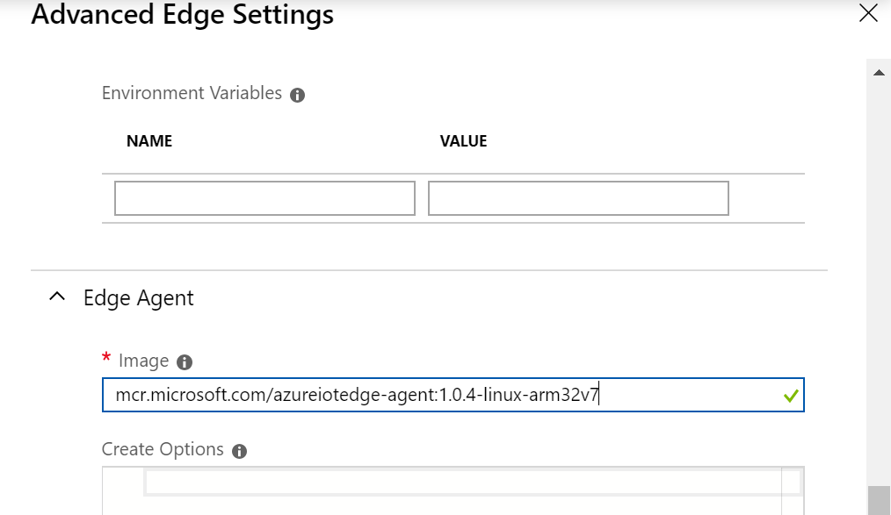

c.  Click on “SAVE” button.

## ·      Configure Azure IoT Edge on TX2 {#configure-azure-iot-edge-on-tx2}

In this step, we will change the default images in the IoT Edge configuration file to support arm64.

a.  Open and edit config file: sudo nano /etc/iotedge/config.yaml

b.  Modify device_connection_string (line26) replacing default text by connection string gotten from previous section

c.  Modify edgeAgent image definition (line 74)

a.  Default: image: &quot;mcr.microsoft.com/azureiotedge-agent:1.0&quot;

b.  Modified: image: &quot;mcr.microsoft.com/azureiotedge-agent:1.0.4-linux-arm32v7&quot;

d.  Restart IoT Edge service: sudo systemctl restart iotedge

# 3.   Prepare containers to use board’s GPU capabilities {#3-prepare-containers-to-use-board-s-gpu-capabilities}

## ·      Create base container for ARM64 and GPU {#create-base-container-for-arm64-and-gpu}

PENDING TO ADD INFORMATION ABOUT BASE CONTAINER FOR ARM64

## ·      Customize container with custom app (your app) {#customize-container-with-custom-app-your-app}

·       PENDING TO ADD INFORMATION ABOUT BASE CONTAINER FOR ARM64

## ·      Create a private image registry in Azure Container Registry {#create-a-private-image-registry-in-azure-container-registry}

a.     Create an Azure Container Registry service following this [tutorial](https://docs.microsoft.com/en-us/azure/container-registry/container-registry-get-started-portal)

b.     Go to your recently deployed Container Registry in Azure and click on “Access Key” option s

c.     Take note on your Login Server name, Username and Password.

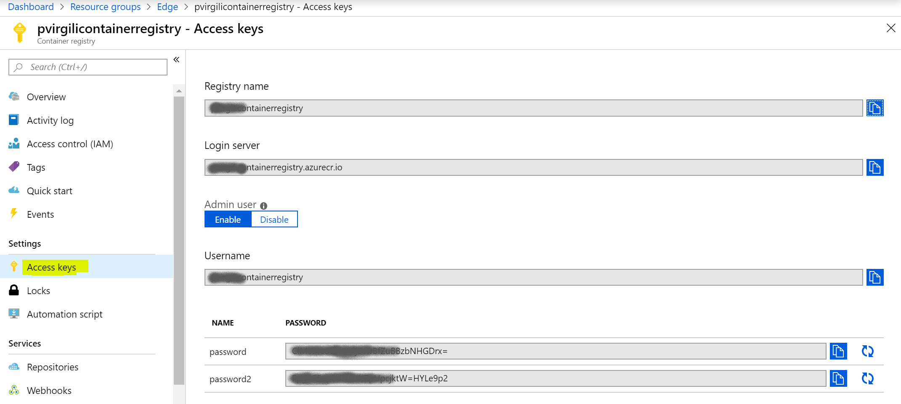

## ·      Upload app image to Azure Container Registry {#upload-app-image-to-azure-container-registry}

a.     Allow Docker to connect your private Azure Container Registry. You must use your credential noted in previous section: docker login ${YOUR_LOGIN_SERVER}

b.      Tag your image application (Optional) docker tag ${YOUR_IMAGE} ${YOUR_LOGIN_SERVER}/${PATH]/${YOUR_IMAGE_NAME} Example: docker tag nginx ${YOUR_LOGIN_SERVER}/samples/nginx

c.     Push your image to Azure Container Registry docker push ${YOUR_LOGIN_SERVER}/${PATH]/${YOUR_IMAGE_NAME}

d.     Go to your Azure Container Registry and validate your image is in your repository

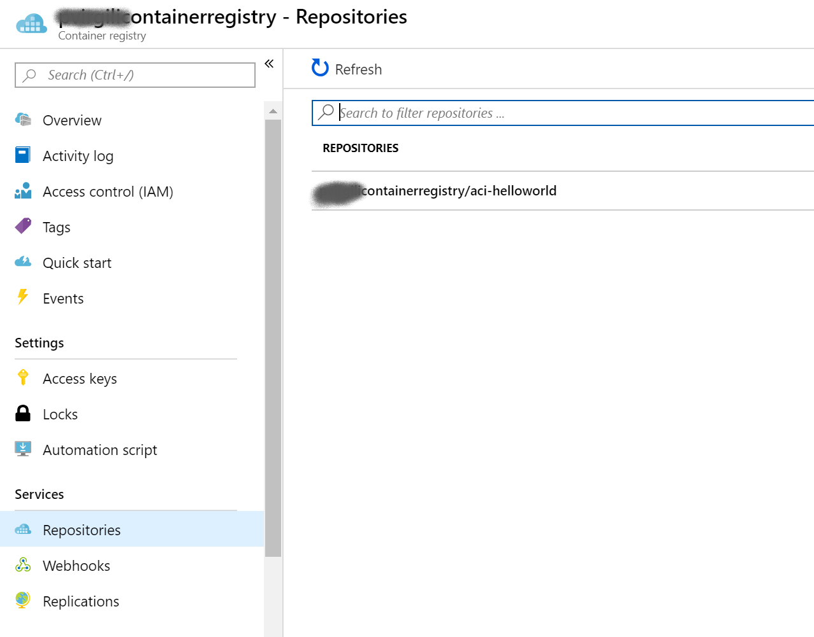

# 4.   Deploy an app using Azure IoT Edge {#4-deploy-an-app-using-azure-iot-edge}

a.     Return to Azure IoT Hub in portal, select IoT Edge from the menu and then choose your IoT Edge device from devices list.

b.     On “Device details” screen, click on “Set modules” option.

c.     In “Container Registry Settings” you must complete the fields based on your credentials. 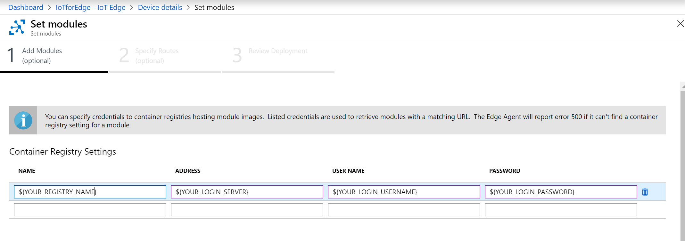

d.     Below in the same page, add a new deployment module and select “IoT Edge Module” 

e.     Complete data related to your module and then click on “Save” button:

a.     **Name**: name of your container image to be deployed in Edge device

b.     **Image URI:** complete it with the full path of your image stored in Azure Example: mycontainerregistry.azurecr.io/myapp

c.     **Container** **Create** **Options** (**optional**): In this section you can describe the bindings required when you create your container. All this options must be defined in a json. This is an example if you need bind ports and devices from the board to your container: _{&quot;HostConfig&quot;:{&quot;PortBindings&quot;:{&quot;8597/tcp&quot;:[{&quot;HostPort&quot;:&quot;8597&quot;}],&quot;8598/tcp&quot;:[{&quot;HostPort&quot;:&quot;8598&quot;}]},&quot;Devices&quot;:[{&quot;PathOnHost&quot;:&quot;/dev/ttyTHS2&quot;,&quot;PathInContainer&quot;:&quot;/dev/ttyTHS2&quot;,&quot;CgroupPermissions&quot;:&quot;mrw&quot;}]}}_ All options are available [here](https://docs.docker.com/engine/api/v1.30/#operation/ContainerCreate).

d.     **Restart** **policy**: select one that best fit for you from the 4 choices defined.

e.     **Desired** **status**: Select running.

f.      **Environment** **variables**: add environment variables if needed. 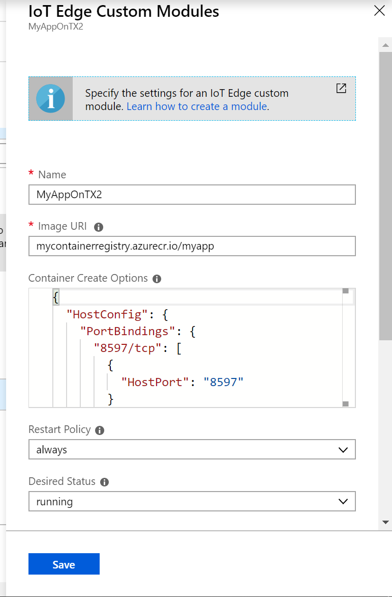

f.      Select “Next” button in the bottom.

g.     A screen to Specify Routes appears. In this we can define how modules can share messages among them and/or with the Azure IoT Hub on cloud.  As we are deploying our first app we can use the default route presented. It means that all messages from all deployed modules must go to IoT Hub.

h.     Click on “Next” button.

i.      After “Review Deployment” appears, click on “Submit” button. This will start remote deployment of the application from Azure to Edge device.

j.      In the Edge device, validate if the image deployed is running: sudo iotedge list